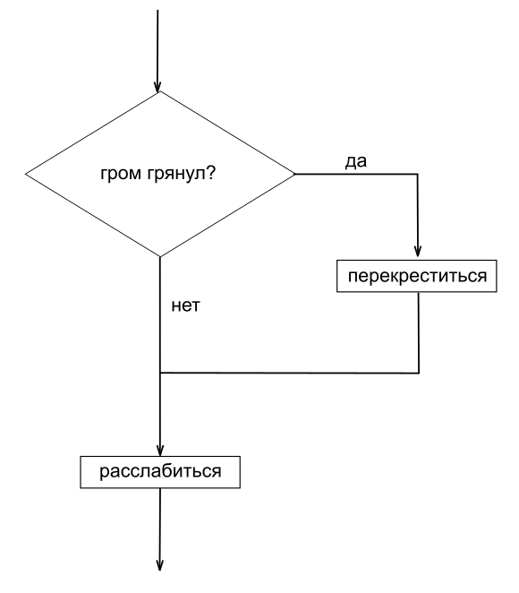
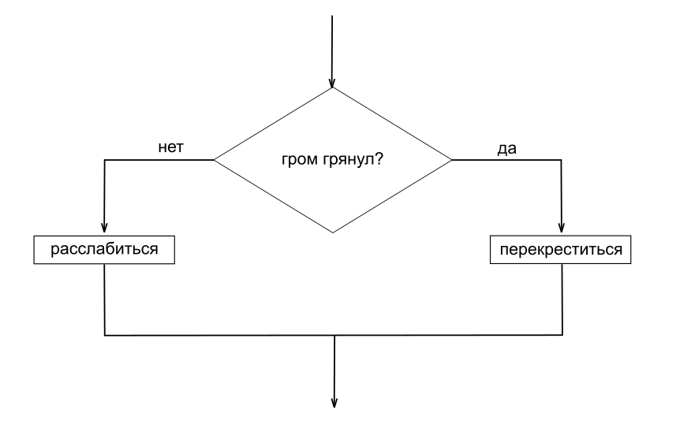
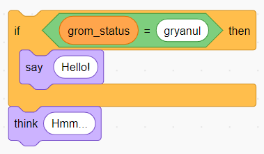
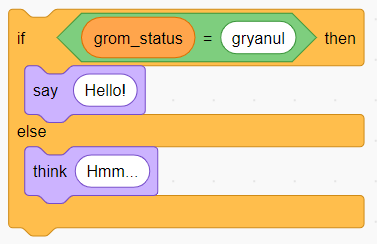
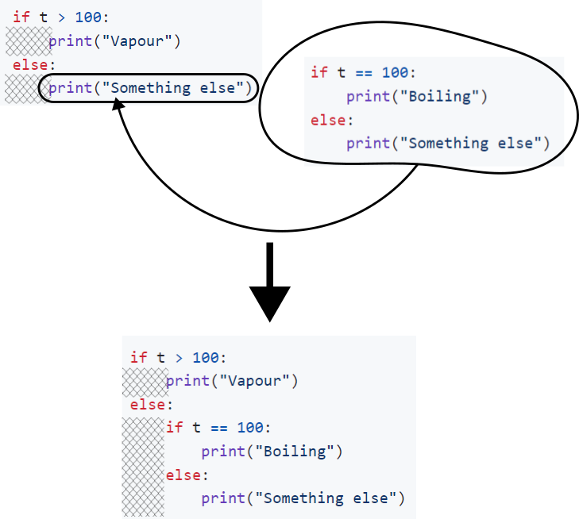

# Введение

## Что это такое

Это довольно детальные планы занятий по программированию на Питоне с теми, кому тема ИТ изначально не очень близка, кто, скорее всего, не намерен становиться профессиональным программистом, а просто хочет приобрести новый навык для общего развития. Из контекста можно догадаться, к кому именно я обращаюсь, но это не так важно - есть желание сделать этот текст полезным для более широкого круга людей.

Конечно, существует много учебников по программированию, рассчитанных на разные уровни знакомства с предметом. Писать ещё один учебник исключительно из тяги к графоманству - отличная идея. Но это скорей именно детальные планы занятий - импровизация не моя сильная сторона. Планы будут писаться по мере нашего продвижения, и не факт, что закончатся чем-то существенным. Всё может прерваться, когда кто-то из нас потеряет интерес, или погрязнет в массе других более важных дел. Однако уже пройденные темы заслуживают того, чтобы составленный по ним конспект где-то остался.

## Чем это не является

Очевидно, много чем. Например, этот текст не является руководством по "вкатыванию в айтишечку". Считаю важным это отметить.

## Методическое замечание, для кого этот учебник

Перед тем как начать, предупрежу, что буду использовать термины более вольно, чем это делают авторы университетских учебников. Что-то буду объяснять просто на примерах, без строгих определений. Также постараюсь очень тщательно "разжёвывать" материал, так как подробных объяснений базовых, обманчиво понятных вещей часто не хватает даже в "популярных" учебниках по программированию. Большинство из них преполагают некоторое предварительное знакомство с предметом или какую-то врождённую способность схватывать ИТ-концепции на лету, а временные пробелы в понимании заполнять интуицией и драйвом. Надо сказать, это очень хорошие качества, но не все ими обладают с самого начала. Даже если нет цели освоить программирование как профессию, развитие минимальной программистской чуйки может быть неплохим интеллектуальным упражнением.

При этом учебник всё-таки не подходит маленьким детям, не знающим, например, значение слова "концепция". Сочинять совсем детский учебник мне пока не интересно.

# Урок 1: что значит программировать, команды, переменные

## 1.1 Что значит программировать

Вообще, компьютер понимает совсем не те команды, с которыми мы будем работать. Компьютер понимает *машинный код*. Машинный код удобен для компьютера, но на нём очень сложно писать программы. Придётся очень подробно рассказывать компьютеру, что ему делать. Настолько подробно, что сперва понадобится тщательно изучить, как работает компьютер на уровне железа. Мы же этого делать не будем.

Приведу аналогию: если б вместо того, чтобы попросить меня сходить в магазин за молоком, ты бы начала давать инструкции, когда какую ногу поднимать, сгибать в колене, когда и куда наклоняться, смотреть, когда и как шевелить пальцами открывая дверь магазина, как напрягать гортань, чтобы издать нужные звуки при общении с продавцом и т.д. Мне всё это не нужно, так как я сам могу перевести просьбу "сходи в магазин за молоком" в набор подробнейших инструкций. Я об этом даже не задумываюсь, ведь в нас, человеков, этот переводчик "зашивается" в первые же годы после рождения: помимо миллиона других вещей мы учимся хождению за молоком.

На компьютер же такой переводчик надо специально установить. В зависимости от деталей он называется "транслятор", "компилятор", "интерпретатор" и пр. Я предустановил интерпретатор Питона - языка программирования, с помощью которого мы будем добиваться от компьютера того, что нам надо.

## 1.2 Выполнение программ на Питоне, компиляторы, интерпретаторы

Программа на Питоне представляет собой *пошаговые инструкции*, опосредовано понятные компьютеру (переводимые в машинный код с помощью интерпретатора). Это не всегда так: программы на других языках программирования могут иметь вид, отличный от перечня действий, но Питон - преимущественно *императивный* язык, то есть мы прямо говорим компьютеру, что делать. В конечном счёте, "родной" машинный язык тоже императивный.

Интерпретатор отличается от компилятора. Компилятор переводит нашу программу в машинный код (иногда - в так называемый байт-код), и этот понятный компьютеру код сохраняется в файле. В Windows эти файлы, как правило, имеют расширение .exe (другими словами, их имена этих файлов заканчиваются на .exe) "exe" - сокращение от "executable" - "выполняемый", то есть тот, который без всяких дополнительных манипуляций может быть прочитан и выполнен компьютером. Именно поэтому так опасно открывать почтовые вложения, с расширением .exe - программа сразу начнёт выполняться и может при этом оказаться вредоносной.

Интерпретатор же не сохраняет машинный код в файл, но сразу же выполняет прочитанные строчка за строчкой команды на "человеческом" (*высокоуровневом*) языке программирования, таком как Питон. Поэтому при работе с Питоном мы будем видеть файлы .py ("py" - это от "PYthon"), которые представляют собой код на Питоне, но не будем трогать никаких "выполняемых" файлов, кроме, пожалуй, самого интерпретатора Питона, который имеет название `python` или `python.exe` в Windows. Интерпретатор - это готовая скомпилированная программа, набор машинных кодов, и эта программа будет выполнять наши программы на Питоне. Да-да, программа выполняет программу! А в конечном счёте их все выполняет компьютер.

## 1.3 Первые строки, вывод на экран

Как человеческий язык состоит из слов, так же и программа состоит из них же, разделенных операторами (аналог знаков препинания). Слова и операторы назовём *лексемами*.

Разберем команду print ниже.

```python
print("Hello Kitty!")
```

Просто открой Notepad и напиши в ней эту строчку и сохрани файл на рабочем столе (File -> Save As..., или нажми Ctrl+S), дав название `kitty1.py`. Можешь выбрать какое-нибудь другое название, лишь бы заканчивалось на `.py` - я настроил Windows так, чтобы по двойному щелчку по файлам `.py` запускался интерпретатор Питона и начинал выполнять программу, сохранённую в файле. Если бы я это не настроил, тебе самой пришлось бы писать в командной строке примерно следующее:

```cmd
python.exe kitty1.py
```

Что означает "запусти интерпетатор Питона и "скорми" ему файл `kitty1.py` в качестве программы для выполнения". Также можно запускать интерпретатор в интерактивном режиме, когда он выполняет команды не из файла, а те, которые ты ему будешь вводить строчка за строчкой ~~целый роман~~, и он сразу же будет их выполнять. Кроме того, есть специализированные редакторы и даже так называемые интегрированные среды разработки (Integrated Development Environments, IDE), одной из которых является [PyCharm](https://www.jetbrains.com/pycharm/). Очень удобная штука, мы обязательно её освоим TODO!!!!!, но для начала будем следовать минималистичному подходу, чтобы состредоточиться на ключевых вещах и не отвлекаться на "приборную панель космолёта", которую из себя представляют современные IDE.

Вернёмся к разбору:

```python
print("Hello Kitty!")
```

`print` - это название действия. Затем мы открываем круглую скобку, обозначающую, что дальше идёт список того, что мы хотим, чтобы компьютер напечатал.

Дальше вместе с кавычками - это всё одна лексема `"Hello Kitty!"`. Лексемы в кавычках представляют собой текст, который мы хотим напечатать, сохранить на диск, отправить по электронной почте, и пр. Кавычки имеют примерно тот же смысл, что и в человеческих языках, они как бы обозначают прямую речь:

```
Выведи на экране: "Hello Kitty!"
```

Язык программирования, в каком-то смысле - это сильно упрощённый человеческий язык. В нём очень мало грамматических исключений и неоднозначностей, что упрощает работу с текстом программы как для человека, так и для компилятора или интерпретатора (так и для того, кто создавал этот компилятор/интерпретатор!).

В Питоне можно использовать апострофы вместо двойных кавычек (апострофы ещё называются одинарными кавычками):

```python
print('Hello Diso!')
```

Но если в тексте уже есть апостроф, то проще воспользоваться двойными кавычками:

```python
print("Diso is Polina's dad")
```

Вместо слова "текст" я буду часто употреблять "строка" ("string") или "строковое значение". Важно не путать *string*-строки и слово "строка", относящееся к той или иной строчке кода ("*line* of code"). Как быть, если в строке (string) присутствуют и апострофы, и двойные кавычки, расскажу потом, там всё не так сложно.

Между названием команды и открывающей круглой скобкой обычно не ставится пробел, то вообще интерпретатор тебя поймёт:

```python
print ("Hello Kitty!")
```

Также можно отделять содержимое внутри скобок от самих скобок:

```python
print ( "Hello Kitty!" )
```

Однако так тоже не принято делать.

Очевидно, программа может состоять сразу из нескольких строк кода (команды в Питоне часто начинаются с новой строки):

```python
print("kitty")
print(42)
print(3+8)
```

Так же запиши их в Notepad, сохрани и выполни.

Заметь, здесь мы оперируем не только строками (strings), но и числами, и даже математическими выражениями. В третьей строчке мы просим компьютер сложить числа 3 и 8 и вывести на экран полученный результат. Числа отличаются от строк тем, что пишутся без кавычек. Однако если нам надо, чтобы наша строка содержала цифры, мы можем легко это сделать:

```python
print("12345")
print("Hello 333!")
```

Можешь написать в Notepad, сохранить и выполнить.

Если мы напишем слово без кавычек, компьютер будет думать, что это не строка, а какая-то команда или что-то ещё, чего он не знает, и выдаст ошибку при попытке выполнения такой программы:

```python
print(kitty)
```

Выдаст:

```
Traceback (most recent call last):
  File "...\kitty1.py", line 1, in <module>
    print(kitty)
          ^^^^^
NameError: name 'kitty' is not defined
```

## 1.4 Переменные

Что есть в Питоне помимо команд, строк и чисел? Есть *переменные*. Переменные - это способ заставить компьютер что-то запоминать, пока он выполняет программу. Представь, что ты сама выполняешь какую-то сложную пошаговую инструкцию, и тебе надо запомнить разные слова и числа по ходу выполнения. Для этого тебе дали блокнот, в котором ты можешь на каждой странице записать либо число, либо текст. И при этом страницу обозначить не просто номером, а дать странице имя. Эта проименованная страница и будет переменной. А текст или число, записанное в ней - её значением.

Если нужно более строгое определение того, что такое переменная, то это *абстракция, представляющая собой проименованную область памяти в среде выполнения*. "Абстракция" - потому что в настоящем "железе" компьютера у ячеек памяти нет произвольных имён. Опуская детали, можно сказать, что у них есть номера (так называемые "адреса"). Возможность оперировать именами переменных нам даёт интерпретатор Питона. Он сам делает всю необходимую магию по переводу имён в номера/адреса, прямо в процессе выполнения твоего кода. Дальше ты убедишься, что использовать названия зачастую удобней, чем номера. А термин "среда выполнения" может означать совокупность компьютерного железа и программ, способствующих выполнению твоей программы. А может - как в примере выше - означать тебя и твою хитрую тетрадку!

Инструкция записать что-то в переменную выглядит довольно просто:

```python
kitty = 'Pet'
```

Обрати внимание, что имя переменной может состоять только из букв, цифр и символов подчёркивания. При этом имя не должно начинаться с цифры. Буквы могут быть как английскими, так и русскими, как строчными, так и заглавными. Имя, написанное строчными буквами, и такое же, но написанное заглавными, считаются разными. Также рекомендуется ограничить свою фантазию в названии переменных строчными английскими буквами и подчёркиванием.

Потом мы сможем ссылаться на запомненное значение по имени переменной:

```python
print(kitty)
```

Напиши эти две строчки кода в одном файле, сохрани, выполни. Дальше я не буду явно напоминать об этом. Ты просто пиши, всё, что тебе интересно повторить и с чем интересно поэкспериментировать. Советую не стесняться, и делать это как можно чаще. В программировании главное - практика.

Значения могут быть как строками, так и числами:

```python
hello = 4
kitty = 9
print(hello + kitty)
```

Пробелы, если что, вокруг плюса желательны, но не обязательны:

```python
print(hello+kitty)
```

И вообще, пробелы мы добавляем, как правило, для лучшей читаемости наших программ.

Разумеется, можно не только складывать:

```python
print(hello * kitty)
print((hello - kitty) * hello)
```

Символ звёздочки (`*`) в Питоне и многих других языках программирования означает умножение. Так исторически сложилось. Ещё ты можешь встретить перечёркнутый по диагонали ноль. Это действительно просто ноль. Программистам важно, чтобы он видимо отличался от буквы "O". Кстати это же одна из причин, почему для умножения используется звёздочка, а не "x".

## 1.5 Конкатенация

Кстати, "складывать" можно не только числа, но и строки. Эта операция называется *конкатенация*. При конкатенации двух строк получается одна строка, состоящая из двух исходных, идущих подряд друг за другом, без всяких пробелов и знаков:

```python
hello = 'LO'
kitty = "VE"
piglet = hello + kitty
print(piglet)
```

Можно передавать выражения команде сразу, без использования переменных:

```python
print('Hello' + ' ' + 'World!')
```

Также обрати внимание, что в сложении и в конкатенации может участвовать более двух слагаемых.

А попробуй сконкатенировать строку и число, например, 42. Что получится?

Интерпретатор "ругнётся" при выполнении:

```
can only concatenate str (not "int") to str
```

В переводе на человеческий это значит: "Могу конкатенировать только строку со строкой (str), а строку с числом (int) не могу." int - это от "integer" - целое (не дробное) число; мы будем работать и с дробными числами, но потом TODO!!!!!.

Как нам тогда выводить комбинации текста и чисел? Можно, конечно, просто вызывать print несколько раз. Но ещё команда `print` принимает в качестве списка на вывод не только одно значение. Если нам нужно вывести сразу список значений, мы указываем их через запятую, внутри круглых скобок, принадлежащих команде `print`:

```python
print(hello, kitty, 333)
```

Все выведенные значения будут разделены пробелом. Обрати внимание, что выводимые значения могут быть разных типов: как строки, так и числа (в Питоне есть и другие типы, но о них позже TODO!!!!!).

## 1.6 Чтение пользовательского ввода, программа-калькулятор

Пока наша программа не делает ничего интересного, и не предусматривает никакой реакции на действия пользователя. Пора добавить интерактива! Скомандуем компьютеру попросить пользователя ввести что-то с клавиатуры:

```python
input("What's your name?")
```

Очевидно, "What's your name?" - это вопрос, который мы хотим обратить к пользователю. Можешь написать что-нибудь другое. Выполнила программу? Что ж, для начала неплохо. Но есть два момента.

1. Пользователь начинает вводить своё имя, а оно примыкает к вопросительному знаку. Обычно это исправляется добавлением пробела в конце строки, перед закрывающей кавычкой:
   ```python
   input("Enter your name: ")
   ```
2. Второй момент более концептуальный. Окей, пользователь ввёл имя, а дальше что? Тут самое время узнать, что многие команды Питона не просто что-то делают, они ещё возвращают какое-нибудь значение. Некоторые команды вообще ничего не делают, а только возвращают какое-то значение в зависимости от переданных значений в круглых скобках. Эти переданные значения называются *параметрами* или *аргументами*. Команда `input`, как мы уже поняли, выводит на экран значение переданного аргумента, а потом считывает ввод пользователя, при этом *возвращая* введенный пользователем текст! Таким образом, мы можем сохранить это значение в переменную для дальнейшей работы с ним.
   ```python
   name = input("Enter your name: ")
   print("Hello", name)
   ```

А попробуй так:

```python
print("Hello", name + "!")
```

Теперь давай напишем программу-калькулятор. Совсем простой калькулятор, который будет спрашивать у пользователя два числа и затем выдавать их сумму. На первый взгляд программа должна выглядеть как-то так:

```python
first_number = input("Enter first number: ")
second_number = input("Enter second number: ")
print("The sum is:", first_number + second_number)
```

Кстати, заметь, как мы пишем названия переменных с использованием строчных букв и символа подчёркивания. Читаемость кода - первое дело!

Позапускай программу, посмотри, как она работает. Что неправильно? Как думаешь, почему так?

Да, введенный пользователем текст, даже если он состоит из одних цифр, оказывается не числовым значением, а строковым; и операция `+` в третьей строчке программы является не сложением, а конкатенацией! Попробуй "скормить" своей программе в этот раз какой-нибудь текст, вместо цифр.

Давай вернемся на шаг назад и представим, как "правильный" вариант с заданными наперёд слагаемыми выглядел бы без команды `input`. Как-то так:

```python
first_number = 3
second_number = 4
print("The sum is:", first_number + second_number)
```

Можешь, кстати, сравнить с "неправильным" вариантом без `input`, который повторял бы нашу исходную ошибку:

```python
first_number = "3"
second_number = "4"
print("The sum is:", first_number + second_number)
```

Хорошо, а можем ли мы как-нибудь скомандовать компьютеру перевести наши строковые значения в целые числа? Да, можем! Для этого есть команда `int`:

```python
first_number = int("3")
second_number = int("4")
print("The sum is:", first_number + second_number)
```

Ура! Работает! Теперь сделаем то же для полноценного варианта с командой `input`. Скомбинируем команды:

```python
first_number = int(input("Enter first number: "))
second_number = int(input("Enter second number: "))
print("The sum is:", first_number + second_number)
```

Обрати внимание на вложенные скобочки. В первой строчке мы говорим компьютеру: "Запроси у пользователя значение, переведи это значение в число и сохрани число в переменную `first_number`" Аналогично - для `second_number` во второй строке.

Как ещё можно скомбинировать команды, чтобы достичь того же результата?

Например так:

```python
first_number = input("Enter first number: ")
second_number = input("Enter second number: ")
print("The sum is:", int(first_number) + int(second_number))
```

Хороший вопрос - а как лучше написать? Я бы предпочёл первый вариант, т.к. в нём явно присутствует выражение `first_number + second_number`, что является сутью нашей программы, можно сказать; и это выражение не "замусорено" всякими техническими деталями типа преобразования типов (т.е. перевода из строки в число).

## 1.7 Порядок выполнения команд

Может показаться, что интерпретатор выполняет команды одна за одной, читая программу сверху вниз. Часто так и есть, но если присмотреться внимательней, в каждой строчке программы, как правило, содержится несколько команд.

Взять даже простой случай:

```python
print(2 + 3)
```

Здесь мы говорим компьютеру:
1. Сложи 2 + 3
2. Выведи результат на экран

Попробуй расписать сама более сложный случай: что и в каком порядке компьютер будет делать, выполняя такую однострочную программу?

```python
print("Hello", input("Enter your name: "), 33 + 1)
```

Можно подумать, что сперва компьютер выведет на экран "Hello". Но это не так. Рассмотрим, как происходит выполнение очередной команды.

Да, интерпретатор читает текст программы сверху вниз, слева направо, как мы читаем книжку. И вот он видит: "`print`. Ага, надо будет что-то вывести на экран!"

Интерпретатор продолжает читать слева направо. Очевидно, после открывающей круглой скобки идёт перечисление того, что именно команда `print` должна будет вывести на экран. Сперва это будет строка (string) `"Hello"`. Тут всё понятно.

Однако интерпретатор не спешит сразу же выводить эту строку! Сперва ему надо понять, а что вообще его попросят вывести на экран. `"Hello"` мы уже разобрали, но есть ещё аргументы. Казалось бы, зачем сначала собирать полный список аргументов, почему бы сразу не выполнить команду? Потому что команды бывают разные, и некоторые не могут быть выполнены без того, чтобы собрать весь список аргументов заранее. Представь, например, аналог плюса - команду `add`.

```python
add(2, 7)
```

Интерпретатор не может выполнить add, прочитав только первый аргумент - двойку! Что прибавлять к двойке-то? Именно поэтому интерпретатор сперва собирает все аргументы для команды.

Когда я говорю "собирает", я подразумеваю кое-что ещё. Чтобы приступить непосредственно к выполнению команды, компьютеру нужны *значения* аргументов. В этом плане компьютер прост и прямолинеен, как продавец в старой рекламе: "Сколько вешать в граммах?" И если бы мы писали в машинных кодах, нам (за некоторыми исключениями) пришлось бы всё так и разжёвывать компьютеру. Однако в Питоне и других языках мы можем написать следующим образом:

```python
add(2, 4 + 3)
```

Или даже так:

```python
add(2, add(4, 3))
```

Интерпретатор, собирая список аргументов для очередной команды, не просто их куда-то там себе складывает, а предварительно *вычисляет* каждый аргумент, если, конечно, есть что вычислять. Например, первый аргумент в примере выше (двойку) вычислять не надо - это уже вычисленное значение, число 2. А вот аргумент `add(4, 3)` компьютеру надо будет сперва вычислить! Таким образом, вся связка `add(2, add(4, 3))` будет выполнена в "вывернутом наизнанку порядке":

1. Складываем 4 и 3
2. Складываем 2 и полученный результат в п.1 (т.е. 7)

Это похоже на то, когда в повествовании автор отвлекается на сторонний сюжет, а потом возвращается к основной линии повествования, при этом обогащённой сторонним сюжетом, в свете которого всё может выглядеть несколько иначе.

Так же поступим и мы и вернёмся к разбору

```python
print("Hello", input("Enter your name: "), 33 + 1)
```

Напомню, интерпретатор уже понял, что ему придётся выводить что-то на экран (команда `print`). Также интерпретатор уже прочитал первый аргумент для этой команды (`"Hello"`), а дальше встретил на своём пути `input("Enter your name: ")`.

`"Hello"` вычислять/выполнять не надо - это уже само по себе значение. А `input(...)` - это команда, и мы не узнаем значение второго аргумента `print`, пока не выполним `input`! Благо, у `input` в качестве аргумента уже готовое значение `"Enter your name: "`, поэтому `input` будет выполнен сходу: на экране появится надпись "Enter your name: ", и пользователь будет должен ввести своё имя (или что ему взбредёт в голову, но предположим, что пользователь честный). И вот результатом выполнения `input` будет строка (string) с именем пользователя, и это же и будет значение второго аргумента для команды `print`!

При этом сбор аргументов для `print` всё ещё не закончен. Следующий (и последний) на очереди - `33 + 1`. Интерпретатор понимает, что `33 + 1` - это не готовое значение (не число), а целое математическое выражение, т.е. по сути тоже набор команд (в данном случае - одна команда), которые нужно выполнить компьютеру - прибавить к тридцати трём единичку. Интерпретатор вычисляет этот сложнейший пример, и полученный результат (численное значение `34`) включает в список аргументов для команды `print`.

Дальше интерпретатор встречает закрывающую скобку и понимает, что аргументов дальше не будет, и что самое время приступить к выполнению команды `print`, так как ему, интерпретатору, уже известно всё, что нужно печатать. В результате выполнения `print` будет выведена строчка:

```
Hello Имя 34
```

(Мы помним, что `print` выводит переданные аргументы через пробелы)

Таким образом, всё выполнение этой небольшой программы будет выглядеть как:

```
Enter your name: Diso
Hello Diso 34
```

Кстати, что-то подобное мы, люди, проделываем, когда решаем примеры, особенно те, в которых много скобочек: не просто проходимся слева направо, а обходим скобочки "сперва в глубину":

```
4 * (10 - (4 + 2) + 1)
```

## 1.8 Практические задания

### Задание 1.1: скобки и апострофы в одной строке

В качестве домашнего задания прошу тебя самой найти способ, как в одной строчке выводить и апострофы, и двойные кавычки. Например, нам надо вывести на экран вот такой вот текст:

```
Я сказал: "Привет, д'Артаньян!"
```

В принципе, ты уже можешь что-то придумать сама, исходя из полученных знаний. Но советую также погуглить и, возможно, даже спросить [ChatGPT](https://chatgpt.com/). Умение хорошо гуглить и формулировать вопросы для ChatGPT - один из ключевых навыков современного программиста. Вполне вероятно, в выдаче Гугла у тебя будут ссылки на сайт [StackOverflow](https://stackoverflow.com/). Это очень полезный сайт, где люди задают вопросы по программированию, а другие на них отвечают. Скорее всего, твои вопросы, которые у тебя будут возникать на первых этапах изучения Питона, уже заданы, и люди со StackOverflow на них уже ответили. Поэтому вводи в строке поиска необходимые ключевые слова и внимательно читай ответы. Важно, конечно, не просто "передирать" код со StackOverflow или откуда-то ещё (это может быть даже опасно!), а стараться понимать решение, и как оно работает.

### Разбор задания 1.1

В ходе выполнения домашнего задания, можешь ввести в Гугле "python double quotes in string". Мне в топе выдачи попалась [вот эта ссылка](https://note.nkmk.me/en/python-str-literal-constructor/). Хорошая заметка, исчерпывающее объяснение. Некоторые термины могут отличаться от тех, что употреблял я, но в общем-целом должны быть понятны из контекста. Так, например, "text sequence" - это тот самый "текст" или строка (string), с которым мы до этого успели поработать.

Также можно спросить [ChatGPT](https://chatgpt.com). Не обязательно формулировать вопрос полностью корректно. Можно написать что-то типа "How to write double quotes in Python?" и получить подробный ответ.

Давай внимательно изучим какой-либо из полученных ответов, и дальше я буду подразумевать, что ты знаешь, как написать двойную кавычку с помощью обратного слэша (backslash) или использовать тройные кавычки в Питоне. Не стесняйся попробовать что-то из приведенных в статьях примерах в своем коде.

### Задание 1.2

Напиши программу, спрашивающую у пользователя любимую марку автомобиля, цену этого автомобиля в рублях, затем ещё одну марку авто и его цену. В ответ на пользовательский ввод программа должна выдавать сообщение:

```
Вместе <первая введённая марка авто> и <вторая введённая марка авто> cтоят <суммарная стоимость> рублей!
Начинайте откладывать!
```

Пример диалога:

```
Какую марку машины вы хотите больше всего? Порше
А сколько рублей она стоит? 100500
Какую марку машины вы хотите чуть меньше, но тоже сильно? МакЛарен
А сколько рублей она стоит? 9000
Вместе Порше и МакЛарен cтоят 109500 рублей!
Начинайте откладывать!
```

### Подсказка к заданию 1.2

При решении задачи конкатенация строк НЕ понадобится!

### Разбор задания 1.2

Пример решения дан ниже:

```python
first_car_make = input("Какую марку машины вы хотите больше всего? ")
first_car_price = int(input("А сколько рублей она стоит? "))
second_car_make = input("Какую марку машины вы хотите чуть меньше, но тоже сильно? ")
second_car_price = int(input("А сколько рублей она стоит? "))
total_price = first_car_price + second_car_price
print("Вместе", first_car_make, "и", second_car_make, "cтоят", total_price, "рублей!")
print("Начинайте откладывать!")
```

На первой строчке мы говорим интерпретатору запросить у пользователя ввести марку его любимого авто (`input(...)`). Команда `input` вернёт введённую пользователем марку в виде строкового значения, и это значение интерпретатор поместит в переменную `first_car_make`, ровно как мы его об этом попросили: 

```python
first_car_make = ...
```

На второй строчке мы говорим интерпретатору запросить у пользователя цену авто в рублях (`input("А сколько рублей она стоит? ")`). Хотя пользователь в ответ введёт какое-то число (рубли же!), команда `input` всё равно вернёт ввод пользователя в виде строкового значения - так работает `input`, по-другому не умеет. А дальше мы сами должны попросить интерпретатор преобразовать введённую строку в число - с помощью команды `int(...)`. Значение, возвращённое командой `int`, интерпретатор сохранит в переменную `first_car_price`:

```python
first_car_price = ...
```

Аналогичные действия мы описываем в двух следующих строчках для второго авто, сохраняя марку и цену машины в переменные `second_car_make` и `second_car_price` соответственно.

Далее мы просим интерпретатор сложить значения переменных `first_car_price` и `second_car_price` и сохранить результат сложения в переменную `total_price`. По выполнении этой строки кода в `total_price` будет содержаться числовое значение суммарной цены.

Обрати внимание, тот факт, что мы оперируем рублями, на уровне кода нигде не отражён, кроме как в командах, осуществляющих диалог с пользователем. Мы безболезненно можем заменить рубли на динары, песо или даже ракушки. Число есть число. Технически мы запрашиваем у пользователя два числа, складываем их и выдаём результат сложения на экране. В нашей простой программе вопрос ковертации валют по курсу не рассматривается, так же не рассматривается и работа с копейками - команда `int` подразумевает, что пользователь вводит *целое* число рублей. Если пользователь в качестве цены вдруг введёт дробное число, например, `23.45`, то интерпретатор выдаст ошибку и прекратит выполнение программы:

```
ValueError: invalid literal for int() with base 10: '23.45'
```

Я специально подобрал шаблон ответа пользователю так, чтобы тебе не надо было мучиться с конкатенацией: все слова и числа в сообщении разделены пробелами, поэтому сообщение можно просто передать в виде ряда аргументов команде `print`:
1. Слово `Вместе`.
2. Марка первой машины - переменная `first_car_make`.
3. Слово `и`.
4. Марка второй машины - переменная `second_car_make`.
5. Слово `стоят`.
6. Суммарная цена - переменная `total_price`.
7. Слово `рублей!` вместе со следующим за ним восклицательным знаком.

Сообщение `Начинайте откладывать!` выводится отдельной командой `print` в конце программы.

### Задание 1.2*

Для комбинированного вывода стороковых и численных значений в предыдущей задаче мы использовали `print` с множественными аргументами:

```python
print(..., ..., ...)
```

Подумай, можно ли как-то получить тот же результат, но с помощью конкатенации? Попробуй написать соответствующую программу. Посмотри, какое сообщение об ошибке ты получишь. Загугли его в комбинации с ключевым словом "Python" (вероятно, поисковик догадается и без подсказки "Python", но почему бы ему и не дать эту подсказку?). Результаты поиска должны помочь тебе узнать, как можно исправить наблюдаемую ошибку.

### Разбор задания 1.2*

Нужно использовать команду `str`, передав ей в качестве аргумента вычисленную сумму, например, так:

```python
...
total_price = first_car_price + second_car_price
total_price_str = str(total_price)
print("Вместе " + first_car_make + " и " + second_car_make + " cтоят " + total_price_str + " рублей!")
```

Команда `str` осуществляет обратное команде `int` действие: к качестве аргумента `str` принимает числовое значение, а возвращает строковое представление переданного значения. То есть если мы передим команде `str` значение `42`, команда вернёт строковое значение `"42"`. Я взял число 42 в кавычки, чтобы подчеркнуть, что это на самом деле не численное, а строковое значение. Очевидно, при выводе на экран интерпретатор не нарисует никаких кавычек, то есть:

```python
print(str(42))
```

выведет на экран просто

```
42
```

Можно сказать, что вывод на экран не отражает внутреннюю сущность выводимых значений.

Если мы попробуем воспользоваться символом сложения при работе с переменными, хранящими результаты выполнения `str`, то убедимся, что мы действительно работает со строками:

```python
a = str(12)
b = str(34)
print(a + b)
```

выведет на экран

```
1234
```

Кроме того, наш код преобразования из числа в строку можно слегка сократить, передав математическое выражение `first_car_price + second_car_price` напрямую в качестве аргумента команде `str`.

```python
...
total_price_str = str(first_car_price + second_car_price)
print("Вместе " + first_car_make + " и " + second_car_make + " cтоят " + total_price_str + " рублей!")
```

Обрати внимание на название переменной `total_price_str`. Конечно, ты можешь давать переменным любые названия в рамках описанных выше ограничений. Однако я руководствовался двумя вещами:
1. Первая часть названия (`total_price`) отражает смысл того, что содержится в переменной.
2. Вторая часть названия (`_str`) обозначает, что это именно *строковая* переменная. Не всегда нужно так делать, но в данном случае я подчёркиваю, что *суммарную цену* (total price) мы запомнили в виде строкового значения, а не в виде числа, как можно было бы подумать по аналогии с переменными `first_car_price` и `second_car_price`. Они-то содержат числа, так как мы их явно получили как результат выполнения команды `int`, и выполняем с ними обычную математическую операцию сложения: `first_car_price + second_car_price`.

А так, чисто технически, ты можешь назвать эту переменную хоть `total_price_str`, хоть `total_price`, хоть `abracadabra`. Более того, можно вообще не использовать переменную с суммарной ценой:

```python
first_car_make = input("Какую марку машины вы хотите больше всего? ")
first_car_price = int(input("А сколько рублей она стоит? "))
second_car_make = input("Какую марку машины вы хотите чуть меньше, но тоже сильно? ")
second_car_price = int(input("А сколько рублей она стоит? "))
print("Вместе " + first_car_make + " и " + second_car_make + " cтоят " + str(first_car_price + second_car_price) + " рублей!")
print("Начинайте откладывать!")
```

Недостаток этого решения в том, что строчка с выводом информации о суммарной цене стала слишком длинной, что затрудняет чтение. Опять же, чисто технически всё будет работать. Но имеется даже официальная рекомендация [не превышать длину строки кода в 79 символов](https://peps.python.org/pep-0008/#maximum-line-length). Мы пока не будем строго следовать этому правилу, но постараемся не городить без крайней надобности нечитаемо длинные строки.

## 1.9 Повтор пройденного

Код нашего складывающего калькулятора выглядит следующим образом:

```python
first_number = int(input("Enter first number: "))
second_number = int(input("Enter second number: "))
print("The sum is:", first_number + second_number)
```

1. Мы знакомы с двумя типами значений в Питоне: текстом/строками (strings) и целыми числами (integers). Текстовые значения записываются в двойных кавычках или апострофах. Числа пишутся просто цифрами.
2. Мы умеем просить компьютер выводить на экран (`print`).
3. Мы понимаем, что многие команды компьютеру в Питоне имеют следующий вид:
   ```python
   some_command_name(argument)
   another_command_name(argument1, argument2, ...)
   ```
   Кстати, бывают команды вообще без аргументов, но со скобочками (скобочки дают понять компилятору, что это именно команда):
   ```python
   third_command()
   ```
4. Мы помним, что команды помимо явного эффекта после их выполнения (как, например, выведенный на экран текст) могут "возвращать" строку, число и т.д. Прямо как функции в математике.
5. С другой стороны, команды могут иметь форму математических выражений: `(2 + 3) * 5` и пр. Возвращаемым результатом математических выражений, очевидно, являются числовые значения: так `(2 + 3) * 5` "вернёт" `25`.
6. Мы не забыли, что для строковых значений тоже есть операция `+`, но она называется не "сложение", а "конкатенация", и результат конкатенации - это новая строка, состоящая из первой и второй, идущий друг за другом подряд.
7. Мы также умеем работать с переменными - запоминать результаты выполнения команд (в том числе результаты вычисления математических выражений). Для того, чтобы записать значение в переменную, мы используем символ `=` после имени переменной. Затем в коде мы можем ссылаться на сохраненное значение по имени нашей переменной. Имя переменной должно состоять из букв, цифр, символа `_` и начинаться с буквы или `_`, но НЕ с цифры!
8. Мы помним, что команда `print` выводит все переданные ей аргументы, разделяя их на экране пробелами. При этом в качестве аргументов можно передавать как непосредственно значения (строки, числа), так и математические выражения `2 + 3` или `first_number + second_number`, а также результаты выполнения других команд. Более того, для `print` типы аргументов могут быть разными: мы можем за один раз попросить вывести на экран сразу несколько значений разных типов. Это не всегда справедливо для остальных команд. С учётом сказанного, мы можем комбинировать наши команды компьютеру:
   ```python
   print("Hello", input("Enter your name: "), 33 + 1)
   ```
9. Мы умеем пользоваться командой `input` - приказать компьютеру запросить у пользователя текст. В качестве результата `input` возвращает введённый текст. Результат можно сразу передать в качестве аргумента в другую команду (см. пример c `input` и `print` выше) или же сохранить в переменную для дальнейшего использования:
   ```python
   name = input("Enter your name: ")
   ```
10. Мы отдаём себе отчёт в том, что `input` возвращает именно string (строковое значение). Если мы хотим над вводом пользователя совершать какие-то математические операции, как в нашем калькуляторе, нам нужно результат `input`'а перевести в числовое значение. В этом нам поможет команда `int`:
    ```python
    first_number = int(input("Enter first number: "))
    ```
11. Помимо прочего, если ты решила задачу 1.2*, то также познакомилась с командой `str`: она осуществляет обратное команде `int` действие: к качестве аргумента принимает числовое значение, а возвращает строковое представление переданного значения.

# Урок 2: комментарии в коде, условный оператор

## 2.1 Комментарии в коде

Выполняя задание 1.1, читая найденные статьи, ты могла встретить строчки, начинающиеся с символа решетки `#` Причем эти строчки как бы являются частью кода. Так и есть, они являются частью кода, но компилятор их игнорирует. Они нужны исключительно для "пометок на полях" - это *комментарии* к коду. Давать комментарии к коду - хорошая практика. Однако лучше всего, когда код легко читать и без большого количества дополнительных комментариев. В популярных языках программирования, каким является Питон, имеется достаточно выразительных средств описания того, что тебе нужно от компьютера. И если ты вынуждена слишком подробно пояснять свой код на человеческом языке, подумай о том, чтобы поработать над читаемостью и ясностью непосредственно программного кода. Пояснения можно разбить на две группы: отвечающие на вопрос, *что* делает код; и на впорос, *почему* он это делает, и почему именно так. На вопрос "что" должен отвечать сам код, а комметарии должны отвечать на вопрос "почему". Всегда есть место исключениям из правил, но каждый раз задумывайся, стоит ли их нарушать в данном конкретном случае.

## 2.2 Условный оператор if

Начнём новую тему. Наш калькулятор замечательно складывает числа. Но что делать, если пользователю ещё нужно и вычитание? Конечно, в такой простой программе на Питоне можно прямо в самом коде поменять плюс на минус и получить новую "фичу". Но программы бывают огромными. Кроме того, как мы помним, многие программы распространяются в виде файлов с машинным кодом, вносить изменения в который уж очень сложно. Короче, мы хотим, чтобы наша программа спрашивала пользователя, хочет ли он складывать или вычитать. Как-то так:

```
Enter first number: 42
Enter second number: 3
If you want to add those numbers, please enter +, or any other text to subtract: +
Result of addition: 45
```

Или в случае вычитания:

```
Enter first number: 42
Enter second number: 3
If you want to add those numbers, please enter +, or any other text to subtract: -
Result of subtraction: 39
```

Пока сделаем так, чтобы было необязательно вводить минус для вычитания, а можно было бы ввести что угодно, кроме `+`. Можно даже просто нажать Enter (т.е. вести *пустую строку*):

```
Enter first number: 5
Enter second number: 1
If you want to add those numbers, please enter +, or any other text to subtract:
Result of subtraction: 4
```

Пожалуй, первые две строчки кода нашего калькулятора оставим без изменений - они делают то, что нам пригодится и в новой версии программы:

```python
first_number = int(input("Enter first number: "))
second_number = int(input("Enter second number: "))
```

А дальше нам нужно запросить у пользователя "код операции" (плюсик или "не-плюсик"). Очевидно, что это будет строковое значение, и мы не будем преобразовывать его в число, а просто сохраним в переменную как есть:

```python
operation = input("If you want to add those numbers, please enter +, or any other text to subtract: ")
```

А теперь нам нужно делать разные вещи, в зависимости от содержимого переменной operation. Грубо говоря, наша логика должна выглядеть так:

```
Если в operation содержится + , то складывай
Иначе - вычитай
```

Такое неформальное описание ещё называется *псевдокодом*. Настоящий (не псевдо-) код на Питоне будет выглядеть примерно так же, но с рядом нюансов, которые обсудим ниже. Также добавлю уже написанные нами строчки программы и пару комментариев в коде, чтобы было наглядней:

```python
# User input

first_number = int(input("Enter first number: "))
second_number = int(input("Enter second number: "))
operation = input("If you want to add those numbers, please enter +, or any other text to subtract: ")

# Calculation

if operation == "+":
    result = first_number + second_number
    print("Result of addition:", result)
else:
    result = first_number - second_number
    print("Result of subtraction:", result)
```

В непустой строке, идущей после комментария `# Calculation` мы видим новую конструкцию:

```python
if условие:
```

В нашем случае "условие" - это то, что значение переменной `operation` должно быть равно `"+"`. Заметь, что в качестве "равно" мы используем не просто символ равенства `=`, а два подряд таких символа: `==`

Ведь одиночный символ равенства у нас уже занят под присвоение значений переменным! А таким "нестандартным" написанием мы даём интерпретатору понять, что мы не сохраняем что-то в переменную, а сравниваем её значение с чем-то, что идёт справа от `==`, то есть с `"+"` в нашем случае. Такая странность присутствует не только в Питоне, но и других языках, однако, не во всех.

Следующие две строчки, идущие после двоеточия, довольно очевидны, за исключением того, что имеют отступ от края. И этот отступ в Питоне играет важную роль. Во-первых, даже если такой отступ был бы необязателен, он сам по себе улучшает читаемость программы: мы сразу видим, что есть два блока, два режима выполнения - первый для сложения, второй для вычитания. Сравни с неправильным вариантом программы без отступов:

```python
if operation == "+":
result = first_number + second_number
print("Result of addition:", result)
else:
result = first_number - second_number
print("Result of subtraction:", result)
```

Если тебе кажется, что и так сойдёт, вспомни, что многие программы состоят из сотен и тысяч строк кода; и читать один большой абзац, как у Льва Толстого - то ещё удовольствие, учитывая, что вникаешь ты, по сути, в длинную пошаговую инструкцию или рецепт, а не в описание переживаний Андрея Болконского. Помимо человеческого фактора есть ещё и чисто "интерпретаторский", т.е. формальный. Представь, что какая-то твоя программа выглядит так:

```python
if grom_gryanul:
perekrestis()
rasslabsya()
```

Как ты прочитаешь такое руководство к действию? Допустим, гром грянул. Надо перекреститься, да? А расслабиться надо? Наверное, да. А если гром не грянул? Ну, наверное, креститься не надо. А расслабляться? Из написанной инструкции не понятно, то ли команда расслабиться относится только к случаю, когда гром грянул, то ли её надо выполнять всегда, вне зависимости от грома.

А вот если мы добавим отступы, всё станет однозначно, как человеку, так и интерпретатору Питона:

```python
if grom_gryanul:
    perekrestis()
rasslabsya()
```

Ну или если расслабляться можно только после того, как перекрестился во время грома:

```python
if grom_gryanul:
    perekrestis()
    rasslabsya()
```

В других языках программирования используются не отступы, а, например, специальные скобочки вкупе с отступами:

```go
if grom_gryanul {
    perekrestis()
}
rasslabsya()
```

Причём отступы используются исключительно для читаемости человеком, а компилятор однозначно поймёт что делать, даже если вся инструкция будет написана в одну строчку:
```go
if grom_gryanul { perekrestis() } rasslabsya()
```

Смысл тот же, но синтаксические правила другие. А в Питоне бал правят отступы. Обычно один уровень отступа - это четыре пробела. В наших программах неизбежно будут и многоуровневые отступы, например, если в случае грома мужику надо сделать что-то ещё, но в зависимости от какого-то дополнительного условия (клюнул ли его жареный петух). Важно не переборщить с вложенными условиями: чем сильней мы "наворачиваем" логику, тем сложней её осмыслить, тем больше шансов самому запутаться в собственном коде, и запутать других. По ходу учёбы мы будем стараться делать наш код понятным для других людей.

Также посмотри примеры *условного ветвления* на визуальных языках и попробуй сопоставить с тем, что мы пишем на Питоне.

На языке [блок-схем](https://ru.wikipedia.org/wiki/%D0%91%D0%BB%D0%BE%D0%BA-%D1%81%D1%85%D0%B5%D0%BC%D0%B0) (это такой визуальный псевдокод для более наглядного представления программ):





На языке [Scratch](https://scratch.mit.edu/):





Видишь, мы, по сути, оформляем то же самое, но текстом. Большинство языков программирования всё-таки текстовые.

Итак, со сложением мы разобрались:

```python
if operation == "+":
    result = first_number + second_number
    print("Result of addition:", result)
```

Посмотрим на код дальше и обнаружим, что у нашей `if`-конструкции есть как бы продолжение - `else`: список команд интерпретатору в случае если условие, указанное в строке с `if`, не было выполнено. Обрати внимание, что и на `else`-блок распространяется правило отступов.

## 2.3 Практические задания

### Задание 2.1: самый простой чат-бот в мире

Напиши программу, спрашивающую у пользователя его имя, а затем возраст в следующем виде (имя "Денис" и возраст 42 пользователь, очевидно, ввёл в ответ на запрос программы):

```
Привет, как тебя зовут? Денис
Привет, Денис! А сколько тебе лет? 42
```

При этом, если пользователю больше сорока лет, программа должна выводить:

```
Преклонный возраст не помеха, Денис! Не забудь принять таблетки.
```

Если же введённый возраст 40 и меньше, ответ должен быть таким:

```
Денис, позови кого-нибудь из взрослых!
```

В самом конце пусть программа попрощается с пользователем, написав ему `Пока!`.

Вот пара примеров диалога:

```
Привет, как тебя зовут? Денис
Привет, Денис! А сколько тебе лет? 42
Преклонный возраст не помеха, Денис! Не забудь принять таблетки.
Пока!
```

```
Привет, как тебя зовут? Неденис
Привет, Неденис! А сколько тебе лет? 39
Неденис, позови кого-нибудь из взрослых!
Пока!
```

### Разбор задания 2.1

Ниже дан возможный вариант программы.

```python
name = input("Привет, как тебя зовут? ")
age = int(input("Привет, " + name + "! А сколько тебе лет? "))
if age > 40:
    print("Преклонный возраст не помеха, " + name + "! Не забудь принять таблетки.")
else:
    print(name + ", позови кого-нибудь из взрослых!")
print("Пока!")
```

В первой строчке программы мы просим интерпретатор узнать у пользователя его имя, выведя при этом `Привет, как тебя зовут?`. Помним также, что сразу после приглашения к вводу (точнее, сразу после вопросительного знака) неплохо будет добавить пробел, чтобы не получилось следующего:

```
Привет, как тебя зовут?Денис
```

В первой же строчке мы говорим интерпретатору сохранить введённую пользователем строку в переменную `name`. Если хочешь поразвлекаться, можешь придумать другие имена переменным. В программе такого размера это не критично. Мы помним, что команда `input` возвращает строковое значение, содержащее то, что пользователь только что ввёл с клавиатуры. И это значение записывается в переменную оператором присвоения значения - одинарным "равно" (`=`).

Во второй строчке мы тоже говорим интерпретатору запросить ввод у пользователя (`input(...)`). Также мы просим его перевести строковое значение, возвращённое командой `input`, в число:

```python
int(input(...))
```

Причём делаем это, так сказать, не отходя от кассы: передаём результат вызова команды `input` в качестве аргумента при вызове команды `int`. Кстати, можно было бы сделать как-то так:

```
age_str = input("Привет, " + name + "! А сколько тебе лет? ")
age = int(age_str)
```

По сути, эти строчки делают то же самое, что и одна строчка со "вложенным" вызовом `input`. Дополнительный шаг здесь - сохранение результата `input` в переменную `age_str`, которую мы дальше используем в качестве аргумента при вызове команды `int`. В данном конкретном случае я бы предпочёл обойтись без этого промежуточного шага, так как он ничего не добавляет для понимания программы человеком.

Подумай (или прямо попробуй, изменив соответствующим образом код программы!), что будет, если не вызывать команду `int`.

Закончим изучение второй строки оригинального решения рассмотрением аргумента, переданного в `input`. И в этот раз мы, естественно, обозначили строку, которую интерпретатор должен выдать в качестве приглашения на ввод возраста.

```python
"Привет, " + name + "! А сколько тебе лет? "
```

Выражение выше представляет собой три соединённые (сконкатенированные!) между собой строки:
1. `"Привет, "` - не забываем пробел после запятой, потому что конкатенация просто стыкует строки между собой впритык. Оставлять пробелы там, где это нужно - задача программиста.
2. `name` - мы помним, что в этой переменной хранится строковое значение, введённое пользователем на вопрос о его имени
3. `"! А сколько тебе лет? "` - восклицательный знак пойдёт сразу после имени, без пробела. Зато ещё один пробел понадобится в конце строки, чтобы отделить ввод пользователя от текста вопроса.

Дальше в коде идёт строка с условным оператором, в которой проверяется значение пременной `age`, больше ли оно сорока. Не забываем, что условный оператор начинается со слова `if`, дальше, после пробела, следует проверяемое выражение (`age > 40`), затем ставится двоеточение и перевод на новую строку.

Следом идёт набор команд, которые нужно выполнить в случае, если проверенное в `if` условие истинно. Чтобы дать понять интерпретатору, где начинается и где заканчивается этот список, мы перед каждой командой делаем отступы (как правило, четыре пробела). В нашем случае список состоит из одной команды (если не считать конкатенации) - это команда `print`. Конкатенация организована образом, схожим с тем, что использовался при запросе возраста у пользователя.

Помимо варианта "старости" у нас есть обратный вариант, при котором интерпретатор должен вывести другое сообщение. Оба эти варианта *взаимоисключающие*, поэтому их можно обозначить конструкцией `if ... else`: сразу после команды `print("Преклонный возраст не помеха, " + name + "! Не забудь принять таблетки.")` мы пишем `else:` и далее - список команд на выполнение в случае, когда условие оператора `if` не выполняется, т.е. когда значение `age` меньше или равно сорока. Заметь, `else:` пишется без отступов, так как не принадлежит списку команд для случая `age > 40`. Это слово, скорее, является разделителем. А вот далее идёт снова список из одной команды, где эта команда (`print`), выделена стандартным отступом в четыре пробела.

В самом конце нашего кода располагается строчка с командой `print`, выводящей сообщение прощания с пользователем. Заметь, что она выводится всегда, вне зависимости от введенного пользователем. Таким образом, она не принадлежит ни одному из списков команд условного оператора, рассмотренного ниже. Поэтому ей не требуется отступ.

### Задание 2.1* и его разбор

Подумай, а можно ли было в задании 2 обойтись без `else`, только с помощью `if` (мы помним, что `if` может идти без секции `else`)?

Да, поведение `else` можно сымитировать дополнительным `if`'ом с условием противоположным, оригинальному:

```python
if age > 40:
    print("Преклонный возраст не помеха, " + name + "! Не забудь принять таблетки.")
if age <= 40:
    print(name + ", позови кого-нибудь из взрослых!")
```

Однако такой вариант организации кода является более подверженным ошибкам. Предположим, что условие `age > 40` поменялось (скажем, теперь граница пожилого востраста пролегает в возрасте 90 лет, причём даже ровно 90 - уже он). В первой строчке нам, очевидно, в качестве условия надо записать `age >= 90`. Кроме того, важно не забыть обновить и противоположное условие во втором условном операторе, то есть записать `age < 90`. Если мы забудем обновить возрастную границу (поменять 40 на 90) или даже такую мелочь, как поменять оператор `<=` на строгое неравенство `<`, то наша программа будет работать некорректно. Поменять оператор на строгое равенство необходимо. Попробуй либо в уме, либо прямо в коде поэкспериментировать и выяснить, что будет, если ты оставишь нестрогое неравенство в обоих условиях:

```python
if age >= 90:
    print("Преклонный возраст не помеха, " + name + "! Не забудь принять таблетки.")
if age <= 90:
    print(name + ", позови кого-нибудь из взрослых!")
```

Что выдаст программа, если пользователь введёт возраст 90?

Таким образом, когда мы работаем со взаимоисключающими условиями, лучше использовать конструкцию `if ... else`.

### Задание 2.1: чуть более сложный чат-бот

Давай усложним сценарий задачи 2.1, и в случае, если пользователь ввёл возраст меньше или равным сорока, программа спрашивала бы пользователя, как зовут кого-то из взрослых, а потом сама "звала" его, упомянув при этом и имя "невзрослого" пользователя. При этом, если пользователь в качестве имени взрослого вводит пустую строку (т.е. сразу нашимает Enter), то программа не зовёт взрослого, а сразу пишет "Пока!" и завершает выполнение.

```
Привет, как тебя зовут? Неденис
Привет, Неденис! А сколько тебе лет? 39
Неденис, как зовут кого-то из взрослых рядом? Кондратий
Кондратий, подойдите, пожалуйста! Неденис нуждается в вашей помощи!
Пока!
```

```
Привет, как тебя зовут? Неденис
Привет, Неденис! А сколько тебе лет? 39
Неденис, как зовут кого-то из взрослых рядом? 
Пока!
```

### Разбор задания 2.1

Пример решения смотри ниже:

```python
name = input("Привет, как тебя зовут? ")
age = int(input("Привет, " + name + "! А сколько тебе лет? "))
if age > 40:
    print("Преклонный возраст не помеха, " + name + "! Не забудь принять таблетки.")
else:
    adult_name = input(name + ", как зовут кого-то из взрослых рядом? ")
    if adult_name != "":
        print(adult_name + ", подойдите, пожалуйста! " + name + " нуждается в вашей помощи!")
print("Пока!")
```

Закономерно, что код очень похож на решение задачи 2, за исключением секции `else`:

```python
else:
    adult_name = input(name + ", как зовут кого-то из взрослых рядом? ")
    if adult_name != "":
        print(adult_name + ", подойдите, пожалуйста! " + name + " нуждается в вашей помощи!")
```

Интерпретатор должен запросить пользователя имя кого-то из взрослых (команда `input`) и сохранить введённый ответ в переменную `adult_name`. Не забываем про отступ в четыре пробела, обозначающий, что действие относится к секции `else`.

Затем интерпретатор встречает на своём пути ещё один условный оператор, вложенный в секцию `else` основного! Условие `adult_name != ""` очевидно: "значение переменной `adult_name` *не равно* пустой строке (двум идущим подряд двойным кавычкам).

Раз уж мы стали использовать в основном двойные кавычки, то и продолжим, во имя единообразия, которое тоже улучшает читаемость кода. Однако же пустую строчку с тем же успехом можно было изобразить и двумя идущими подряд одинарными кавычками (апострофами).

Этот оператор `if` также выделен отступом в четыре пробела, так как принадлежит тому же списку команд, которые надо выполнить, если пользователь слишком молод.

Следующая же строчка представляет собой знакомую нам уже команду `print`, но с двумя важными особенностями:
1. В конкатенации участвуют сразу две переменных - `adult_name` и `name` - так можно. Можно конкатенировать сколько угодно переменных и строковых значений между собой, лишь бы это было читаемо.
2. Вся команда выделена *двойным* отступом в восемь пробелов.  Первые четыре пробела обозначают, что команда всё так же принадлежит секции `else` проверки возраста. Вторые четыре пробела сообщают интерпретатору, что конкретно эта команда принадлежит списку команд, которые нужно выполнять в случае, если выполнено условие из оператора `if` строчкой выше.

Обрати внимание, на следующей строчке происходит резкий скачок влево, так как, как мы уже осудили, команда `print("Пока!")` не относится ни к какому из списков условных операторов и пишется без каких-либо отступов.

# Ещё о подборе названий

Заострю внимание на названии переменной. `operation` из примера с каклькулятором - не какое волшебное слово из Питона, а произвольно выбранное название. Вместо `operation` переменную можно было назвать `o`, `op`, `bro` или, скажем, `benedetta`. Однако имя `operation` подходит больше по смыслу и даёт подсказку человеку, читающему твой код (в том числе и тебе самой). Кстати, ныне покойный программист Фил Карлтон многим известен [афоризмом](https://skeptics.stackexchange.com/questions/19836/has-phil-karlton-ever-said-there-are-only-two-hard-things-in-computer-science): "В информатике есть только две сложных задачи: инвалидация кэша и выбор подходящих названий". Со второй, как видишь, мы уже столкнулись.

# Конструкция elif

Для работы со *взаимоисключающими* условиями существует более универсальная конструкция: "если ... то, иначе если ... то, иначе если ... то, иначе ...":

```python
if условие_1:
    blah()
elif условие_2:
    blahblah()
elif условие_3:
    blahblahblah()
...
else:
    ...
```

`elif` здесь - это сокращение от `else if`. Примерно как в английском мы говорим и пишем "doesn't" вместо "does not". Только в Питоне `elif` писать обязательно. Если ты напишешь `else if`, интерпретатор тебя не поймёт.

Если вдруг не совсем понятно, к чему все эти сложности с `elif`, рассмотрим пример. Представим, у нас есть чайник с водой, и температура воды в нём равна `t`.

```python
if t > 100:
    print("Vapour")
elif t == 100:
    print("Boiling")
elif t > 0:
    print("Liquid")
elif t == 0:
    print("Transient")
else:
    print("Solid")
print("That's all folks!")
```

Предположим, что переменная `t` равна `120`. Интерпретатор увидит, что условие `t > 100` выполняется и приступит к выполнению `print("Vapour")`. Затем интерпретатор пропустит все остальные проверки, так как остальные варианты проверялись бы только если условие `t > 100` *не* выполнялось бы. Когда интерпретатор дойдёт до `print("That's all folks!")`, он выполнит эту команду, так как для её выполнения не указано никакого условия, она не относится ни к какому из блоков `if`/`elif`/`else`, её просто надо выполнить. На экране окажутся сообщения:

```
Vapour
That's all folks!
```

Теперь разберём тот же пример, но без `elif`'ов.

```python
if t > 100:
    print("Vapour")
if t == 100:
    print("Boiling")
if t > 0:
    print("Liquid")
if t == 0:
    print("Transient")
else:
    print("Solid")
print("That's all folks!")
```

Предположим, что переменная `t` всё так же равна `120`. Интерпретатор увидит, что условие `t > 100` выполняется, и приступит к `print("Vapour")`. Затем интерпретатор проверит условие `t == 100`, оно *не* выполняется; команда `print("Boiling")` будет им проигнорирована. Потом интерпретатор увидит, что вот условие `t > 0` как раз выполняется (`120` больше нуля!), и выполнит комадну `print("Liquid")`. Затем он проверит условие `t == 0`. Оно, конечно же, *не* выполняется. Но дальше инетпретатор дойдёт до строчки `else`, а она относится к `if t == 0` (и только к нему!). Что ж, если интерпретатор до этого отказался печатать `Transient` (и правильно сделал, потому что `120` действительно не равно нулю) то "обратное" действие, указанное в блоке `else` он честно выполнит - напечатает `Solid`. После он также напечатает и `That's all folks!`, потому что, как и в первом варианте, команда `print("That's all folks!")` не относится ни какому условному блоку. Итого на экране будет выведена маловразумительная для ста двадцати градусов ерунда:

```
Vapour
Liquid
Solid
That's all folks!
```

`Vapour`, `Liquid` и `Solid` - взаимосключающие состояния, а наша гипотетическая вода в чайнике не кот Шрёдингера, чтобы быть сразу в нескольких состояниях одновременно!

# Задание 4: альтернатива elif

Подумай, а можно ли как-то обойтись без `elif`, только использованием `if` и `else`? Как будет выглядеть программа с чайником?

## Разбор задания 4

Давай начнём с упрощённого случая: напишем программу, которая выдаёт `Vapour`, если температура больше ста градусов, а в противном случае выводит на экран `Something else`. Другими словами, сперва полноценно обработаем только первый случай, когда температура в чайнике выше ста градусов. Здесь можно обойтись базовой конструкцией `if ... else`:

```python
if t > 100:
    print("Vapour")
else:
    print("Something else")
```

Всё, что нам осталось - это заменить `print("Something else")` на полноценную (более детальную) обработку. Что значит "более детальную"?

Взглянем ещё раз на оригинальный код и составим список вариантов для обработки:

```python
if t > 100:
    print("Vapour")
elif t == 100:
    print("Boiling")
elif t > 0:
    print("Liquid")
elif t == 0:
    print("Transient")
else:
    print("Solid")
print("That's all folks!")
```

1. `t > 100` - уже сделан!
2. `t == 100`
3. `t > 0` - получается от нуля до ста (*не* включительно)
4. `t == 0`
5. `t < 0` - подразумевается неявно секцией `else`, потому что все остальные варианты уже исключены

Таким образом, нам осталось покрыть варианты 2-6. Давай также, как и в предыдущем шаге, упростим задачу: сведём её к вариантам `t == 100` и "остальное", при этом помня, что вариант `t > 0` нам рассматривать уже не надо. Вырванный из контекста, наш код выглядел бы так:

```python
if t == 100:
    print("Boiling")
else:
    print("Something else")
```

А теперь поместим этот кусок в контекст уже написанного нами кода:

```python
if t > 100:
    print("Vapour")
else:
    if t == 100:
        print("Boiling")
    else:
        print("Something else")
```

Обрати внимание, вставленный кусок выделен отступами, так как он принадлежит секции `else` условного оператора `if t > 100`! Графически наше действие можно представить так:



Мы просто заменили `print("Something else")` на `if t == 0 ... else ...`.

Продолжим в том же духе, покрывая оставшиеся варианты значений `t` и наращивая уровни вложенности. Имеющийся `print("Something else")` заменим на обработку `if t > 0 ... else ....`, то есть покроем случай 3:

```python
if t > 100:
    print("Vapour")
else:
    if t == 100:
        print("Boiling")
    else:
        if t > 0:
            print("Liquid")
        else:
            print("Something else")
```

Предпримем ещё один шаг и заменим текущий `print("Something else")` на `if t == 0 ... else ...`:

```python
if t > 100:
    print("Vapour")
else:
    if t == 100:
        print("Boiling")
    else:
        if t > 0:
            print("Liquid")
        else:
            if t == 0:
                print("Transient")
            else:
                print("Solid")
```

В этот раз мы покрыли случаи 4 и 5. В самом конце не забудем добавить команду `print("That's all folks!")`, которая выполняется вне зависимости от температуры в чайнке (то есть вне зависимости от значения переменной `t`):

```python
if t > 100:
    print("Vapour")
else:
    if t == 100:
        print("Boiling")
    else:
        if t > 0:
            print("Liquid")
        else:
            if t == 0:
                print("Transient")
            else:
                print("Solid")
print("That's all folks!")
```

Мы закончили! Наш код по смыслу идентичен оригиналу:

```python
if t > 100:
    print("Vapour")
elif t == 100:
    print("Boiling")
elif t > 0:
    print("Liquid")
elif t == 0:
    print("Transient")
else:
    print("Solid")
print("That's all folks!")
```

Согласись, ~~неповторимый~~ оригинал выглядит более удобоваримым. Любители Маяковского, вероятно, оценят наш шедевр со вложенными `if`'ами, но даже им будет слегка затруднительно понять, что хотел сказать автор.

Конструкции языка программирования, без которых можно обойтись (как `elif`), но которые добавляют выразительности коду, часто называют *синтаксическим сахаром*.

Также обрати внимание, как мы решали эту задачу: на каждом шаге мы сводили её к более простой задаче, обрабатывающей только два случая. Обработку первого случая на каждом шаге мы записывали сходу, так как нам было сразу понятно, что надо делать, а обработку второго (противоположного) случая мы оставляли на потом, детализируя её на следующем шаге, пока не исчерпали все обрабатываемые варианты. Запомни этот подход - от простого к сложному. Похожая ситуация наблюдается много где. Например, художник может начать писать портрет "от куска", сразу сосредотачиваясь на ресничках левого глаза. Однако это требует недюжей сноровки. Поэтому более универсальный подход - быстрыми широкими мазками обозначить овал лица, основные соотношения формы, цвета и тона, а затем постепенно уточять их.

# Задание 5: расширение функциональности калькулятора

Полагаясь на вышеобозначенную конструкцию, пожалуйста, добавь в наш калькулятор фичи умножения и деления. Cперва продумай и пропиши примеры, как будет выглядеть взаимодействие с пользователем, подобно тому, как я делал чуть раньше. Затем добавь какую-то одну фичу, скажем, умножение. Убедись, что она работает. Также убедись, что ты ничего не сломала из уже реализованных фич. А затем добавь и протестируй оставшуюся фичу - деление.

Кстати, тестирование - важнейшая часть разработки программ, но оно довольно быстро становится скучным: добавлять новые фичи гораздо веселей! Особенно бесит каждый раз перепроверять, что ты ничего не сломала из уже написанного (это называется регрессионное тестирование). Поэтому мы будем стремиться автоматизировать наши тесты. Как это делать - расскажу позже. TODO!!!!!!

И ещё. Когда пользователь вводит что-то кроме знака операции `+`, `-`, `*` или `/`, сделай так, чтобы программа выдавала сообщение `I don't understand you!`. Так наша программа будет чуть предсказуемей с точки зрения пользователя. UX (*User eXperience*) - опыт и впечателения пользователя от взаимодействия с программой - тоже очень важная штука. Чем меньше неоднозначностей и нестандартных преположений, тем лучше.

## Разбор задания 5

TODO!!!!!!!!!!!!

# Повтор пройденного

TODO!!!!!!!!!!!!

# Циклы

А теперь давай сделаем так, чтобы программа переспрашивала пользователя до тех пор, пока он не введёт правильный знак операции. Пока даже не будем разрешать прерывать выполнение программы каким-либо красивым способом - будем навязчиво просить пользователя ввести что-нибудь, пока он не введёт знакомый нам знак.

Проверка ввода, кстати, называется *валидацией*. Например, когда ты на веб-сайте вводишь свой имейл, программа проверяет, чтобы имейл содержал символ собака `@`, минимум одну точку, разделяющую символы после собаки и пр. Или когда тебя просят придумать сложный пароль и потом сообщают, что твой пароль недостаточно сложен, т.к. слишком короткий - это тоже валидация пользовательского ввода.

Для того, чтобы *что-то делать, пока выполняется какое-то условие*, в Питоне имеется конструкция "while-loop" или "цикл while":
```python
while условие:
    do_something()
    do_something_more()
    blah()
```

Не забываем про отступы, которые показывают, что именно относится к `while`, а что выполнять единожды после того, как интерпретатор покончит с `while`, т.е. пока не нарушится условие, заданное в "шапке" цикла.

Интерпретатор, встретив `while` первым делом проверит, не нарушено ли уже заданное условие. Если условие нарушено, то интерпретатор пропускает сразу весь `while`-блок. Всё, что содержится в "теле" цикла (т.е. команды с отступом), будет проигнорировано. Однако если же условие выполняется, инртерпретатор будет выполнять команды, указанные в "теле" цикла, одну за другой: в примере выше это `do_something()`, `do_something_more()` и `blah()`. После этого интерпретатор перепрыгнет обратно к "шапке" цикла, т.е. к строчке `while условие:` в нашем примере. И снова проверит, выполняется или нарушено заданное условие. Если условие нарушено, то интерпретатор, больше не выполняет инструкции из "тела" цикла, а идёт дальше. Если условие выполняется, то интерпретатор заходит на второй круг и затем снова возвращается к "шапке", снова проверяет условие, и так пока оно не будет нарушено. Если условие всегда выполняется, интерпретатор застрянет в этом цикле навсегда. Точнее, пока пользователь не прервёт выполнение программы каким-нибудь более грубым способом, например, нажав `Ctrl+C` (то есть, зажав клавишу `Ctrl` и вместе с ней клавишу `C`). Это стандартный способ более грубого останова программ; работает много где. Можно также попытаться просто закрыть окно с программой.

В первом приближении наша программа должна выглядеть следующим образом (приведу пока только верхний кусок):

```python
# User input

first_number = int(input("Enter first number: "))
second_number = int(input("Enter second number: "))

while operation != "+" and operation != "-" and operation != "*" and operation != "/":
    operation = input("Please enter an operation sign (+, -, *, /): ")

# Calculation
...
```

"Шапку" нашего цикла можно прочитать так: "Выполняй, пока значение переменной `operation` не равно `+`, *и* значение переменной `operation` не равно `-`, *и* значение переменной `operation` не равно `*`, *и* значение переменной `operation` не равно `/`"

Пусть тебя не смущает `!=` в условии, это всего лишь способ сказать интерпретатору Питона "НЕ РАВНО". Когда придумывали Питон, символ `≠` ещё не был распространён на компьютерах, да и сейчас нет простого способа быстро его ввести с клавиатуры.

Ну а что именно интерпретатору нужно выполнять, сказано в "теле" цикла - запрашивать пользователя ввести знак и сохранять ввод в переменную `operation`.

Увы, когда мы попытаемся выполнить такую программу, интерпретатор, дойдя до строчки `while`, прервёт выполнение с ошибкой:

```
Traceback (most recent call last):
  File "...", line 7, in <module>
    while operation != "+" and operation != "-" and operation != "*" and operation != "/":
          ^^^^^^^^^
NameError: name 'operation' is not defined. Did you mean: 'StopIteration'?
```

Мы ссылаемся на переменную `operation`, уже как на содержащую какое-то значение, когда ещё не записали в неё ничего! Такое интерпретатор Питона не любит, но это легко починить - надо всего лишь присвоить переменной `operation` какое-нибудь значение *до* объявления цикла:

```python
# User input

first_number = int(input("Enter first number: "))
second_number = int(input("Enter second number: "))

operation = "Nya"

while operation != "+" and operation != "-" and operation != "*" and operation != "/":
    operation = input("Please enter an operation sign (+, -, *, /): ")

# Calculation
...
```

Ради смеха я присвоил перменной `operation` значение `"Nya"`. Можно было присвоить пробел `" "`, пустую строку `""`, или даже какое-нибудь число (`0` или `42`).

Присваивание переменной начального значение называется *инициализацией*. В некоторых случаях (даже в Питоне) допускается ссылаться на непроинициализированную явным образом область памяти, и с этим надо тоже быть аккуратней. Есть даже анекдот на эту тему:

*Вовочке дали три яблока. Два он съел. Сколько яблок у него осталось? Думаете одно? Ничего подобного. Никто же не знает сколько у него уже было яблок до этого. Мораль - инициализируйте переменные!*

# Задание 6: валидация ввода с сообщением об ошибке

Измени код так, чтобы когда пользователь вводил что-то помимо символов `+`, `-`, `*`, `/`, программа не просто переспрашивала бы пользовователя ввести знак операции, а при этом бы ещё сперва "ругалась" фразой "I'm not quite getting you!".

То есть взаимодействие с программой выглядело бы примерно так:

```
Enter first number: 3
Enter second number: 5
Please enter an operation sign (+, -, *, /): dsfd
I'm not quite getting you!
Please enter an operation sign (+, -, *, /): ff
I'm not quite getting you!
Please enter an operation sign (+, -, *, /): +
Result of addition: 8
```

## Разбор задания 6

Вариант решения смотри ниже.

```python
# User input

first_number = int(input("Enter first number: "))
second_number = int(input("Enter second number: "))

operation = input("Please enter an operation sign (+, -, *, /): ")
while operation != "+" and operation != "-" and operation != "*" and operation != "/":
    print("I'm not quite getting you!")
    operation = input("Please enter an operation sign (+, -, *, /): ")

# Calculation

if operation == "+":
    result = first_number + second_number
    print("Result of addition:", result)
elif operation == "-":
    result = first_number - second_number
    print("Result of subtraction:", result)
elif operation == "*":
    result = first_number * second_number
    print("Result of multiplication:", result)
elif operation == "/":
    result = first_number / second_number
    print("Result of division:", result)
else:
    print("I don't understand you!")
```

Видишь, мы инициализируем переменную `operation` не просто каким-то заранее выбранным значением, а значением, возвращаемым командой `input`. В первый раз интерпретатор выведет `Please enter an operation sign (+, -, *, /): ` и считает ввод пользователя без каких-либо жалоб (третий по счёту вызов `input` в коде, после запроса чисел, до цикла `while`). Затем интерпретатор дойдёт до цикла `while` проверит условие цикла, т.е. ввёл ли пользователь лабуду (`operation != "+" and operation != "-" and operation != "*" and operation != "/"`). Если пользователь таки ввёл лабуду, то интерпретатор начнёт выполнять тело цикла, и первым делом выдаст сообщение о некорректном вводе: `print("I'm not quite getting you!")`. Дальше интерпретатор снова попросит ввести пользователя знак операции и сохранит введённую пользователем строку в `operation`. Наконец, интерпретатор прыгнет обратно на начало цикла - на проверку значения `operation`. И так далее, пока пользователь не введёт знак операции.

Я специально допустил незначительную ошибку в коде. Точнее, программа будет работать совершенно корректно, но кое-что в ней может быть улучшено. Подсказку смотри дальше.

Какой-то кусок кода в программе теперь явно лишний. Этот кусок находится ближе к концу программы. Ответ смотри ещё дальше.

Конечно, можно удалить

```python
else:
    print("I don't understand you!")
```

Ведь до этих строк интерпретатор теперь никогда не дойдёт: в секции `User input` мы добиваемся от пользователя корректного ввода, и к моменту выполнения секции `Calculation` в переменной `operation` уже гарантировано содержится одно из значений `"+"`, `"-"`, `"*"` или `"/"`. `else`-секция просто никогда не сработает!

Наличие так называемого *мёртвого кода* затрудняет понимание, поэтому лучше от него вовремя избавляться.

# Методическое замечание

Скорее всего, тебе ещё очень сложно читать код, понимать его и выполнять у себя в голове, тем более, с разными вариантами ввода. А ещё сложней - придумывать, что писать, чтобы решать предложенные мной задачки. Это совершенно нормально, и похоже на изучение иностранного языка. Позже ты будешь читать хороший код легко и непринуждённо, как газету. А пока я буду достаточно подробно расписывать каждую строчку и идеи, стоящие за этими строчками. Вообще, это хорошее упражнение: описывать ход выполнения программы человеческим языком. При этом важно избегать безличных оборотов и их аналогов: "значение записывается в переменную" или "мы записываем значение в переменную". Оба варианта плохие, потому что не отвечают на вопрос, кто на самом деле выполняет действие (записывает значение). В приведённом примере можно сказать, что это делает интерпретатор. В дальнейшем ты будешь оперировать абстракциями другого уровня, и в твоём повествовании будут другие действующие лица. Но и тогда будет необходимо чётко представлять, кто что делает, и не маскировать своё непонимание за безличными оборотами.

# Повтор пройденного

1. Мы изучили цикл `while`, понимаем что он состоит из *условия* (пишется на одной строчке с `while`, "обрамляется" двоеточием и переводом на новую строку), а также из *тела*: набора команд, выделенных отступом.
   ```python
   while условие:
       do_something()
       do_something_more()
       blah()
   ```
2. Условие проверяется каждый раз перед выполнением команд из тела цикла. Если условие на момент проверки выполняется, интерпретатор выполняет целиком все команды, указанные в теле цикла, а затем возвращается к проверке условия, и всё повторяется.
3. При этом важно всегда инициализировать переменные правильными значениями. Это важно далеко не только в контексте работы циклов, однако же, цикл просто не выполнится, если мы в его условии сошлёмся на ещё не объявленную переменную (тогда интерпретатор выведет ошибку и прекратит выполнение программы), либо значение переменной может оказаться таким, что условие цикла с самого не выполнится, и, соответственно, не выполнятся нужные нам действия в теле цикла.
4. Также мы помним, равенство значения переменной проверяется символом "двойного равно" `==`, так как "одинарное равно" в Питоне уже задействовано под присвоение значения. "Не равно", в свою очередь, записывается символами восклицательного знака и равенства: `!=` - вместо "классического" символа перечёркнутого равенства `≠`. Также для сравнения значений полезны операторы "меньше" `<`, "меньше или равно" `<=`, "больше" `>` и "больше или равно" `>=`.
5. Кроме того,  мы интуитивно, без строгих определений ввели понятие "логического и" и использовали соответствующий оператор (`and`) в условии цикла:
   ```python
   operation != "+" and operation != "-" and operation != "*" and operation != "/"
   ```
   Данное условие выполняется только в том случае, если значение переменной `operation` не равно `"+"`, а также оно не равно `"-"`, а также оно не равно `"*"`, а кроме того оно не равно `"/"`. В русском языке мы используем обороты "а также" и "кроме того", но в принципе, их можно даже в русской речи заменить на союз "и". Условие будет звучать немного куце, но тоже вполне однозначно: значение переменной `operation` не равно `"+"`, и оно не равно `"-"`, и оно не равно `"*"`, и оно не равно `"/"`. Питон же использует `and` для обозначения таких комбинированных условий. При этом в языках программирования нет необходимости избегать повторов, заменяя слова из подлежащего на местоимение при последующем употреблении ("*значение переменной `operation`* не равно `"+"`, и *оно* не равно..."). Далее мы рассмотрим ещё несколько инструментов, которые позволят нам составлять логические условия любой сложности.
6. Упомянув произвольную сложность, хочу также напомнить, что код должен оставаться простым. Хотя код и выполняется компьютером, но пишется и меняется, как правило, человеком. В рамках повторения пройденного позволю себе упомянуть название, которое не встречалось раньше в тексте: принцип "KISS". KISS расшифровывается как "[Keep it simple, stupid!](https://en.wikipedia.org/wiki/KISS_principle)". Программисты часто грешат тем, что предпочитают более сложные решения без особой надобности, оправдывая свой выбор оптимизацией или заделом на будущее. Последние две цели действительно имеют право на существование, но важно находить баланс между ними и простотой. Умение находить этот баланс приходит с опытом.
7. Кроме того, простоте очень способствует отсутствие в программе так называемого мёртвого кода - тех команд, которые ни при каких условиях не могут быть выполнены. В нашем примере калькулятора мы идентифицировали такой кусок:
   ```python
   else:
       print("I don't understand you!")
   ```
   Эта команда `print` никогда не выполнялась бы, потому что перед ней мы добавили команды, которые не позволяли пользователю вводить некорректный код операции (точнее, если пользователь вводил какую-то белиберду, инетпретатор перезапрашивал код операции).

# Булева алгебра

В предыдущем разделе мы чуть более подробно разобрали условие с логическим "и" (`operation != "+" and operation != "-" and operation != "*" and operation != "/"`). Настало время изучить предмет глубже, чтобы получить в своё распоряжение полноценный набор инструментов для составления условий. Помимо операторов сравнения (`==`, `!=`, `<`, `<=`, `>`, `>=`) и оператора логического "и" (`and`) нам понадобятся логическое "или" (`or`), логическое "не" (`not`) и круглые скобочки для группировки разных частей нашего условия.

К сожалению, это может показаться самой нудной темой, но без неё вряд ли получится уверенно и осознанно продвигаться дальше.

TODO!!!!!!!!!!!!!
